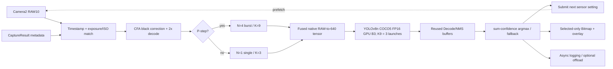

# Final RayNeo SoS Pipeline



동기 critical path는 필요한 RAW 대기, fused candidate formation, GPU batch inference,
Decode/NMS, best-cell 결정까지다. Camera2 callback, 다음 capture 요청, health sampling,
선택 JPEG 저장, UI와 network offload는 별도 callback/queue로 분리한다. 단, burst에서
선택한 shutter가 다음 single request를 결정하는 data dependency 자체는 유지된다.

P=5 기본 schedule:

```text
N4/K9 burst → shutter argmax
→ 같은 shutter의 finite N1 sequence 4장 요청
→ 그 뒤에 다음 N4 burst를 미리 queue
→ K3 single #1 → #2 → #3 → #4
→ 이미 준비된 다음 burst 사용
```

P=9/12도 동일 원리로 single sequence 길이만 각각 8/11로 바뀐다.
